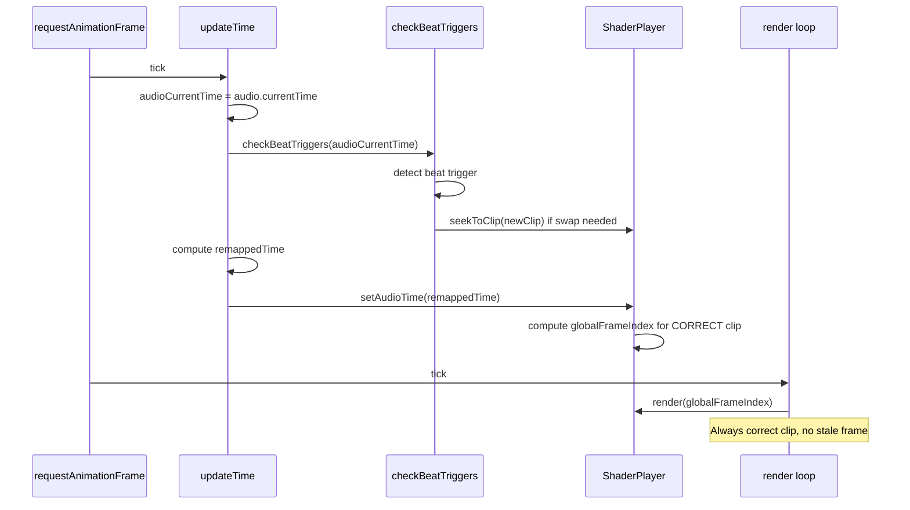

# Clip Switch Race Condition Fix

## Problem

When speed ramping was active and clips auto-switched on beats, a glitchy 1-frame flash of the old clip appeared ~50% of the time during transitions.

## Root Cause: Two Independent rAF Loops + Svelte Microtask

There were two independent `requestAnimationFrame` loops running concurrently:

- **Loop A**: `render()` in `ShaderPlayer.svelte` — renders the current `globalFrameIndex` to the WebGL canvas
- **Loop B**: `updateTime()` in `VideoWorkbench.svelte` — reads audio time, computes speed ramp, calls `setAudioTime()`

And one Svelte reactive effect that fired asynchronously:

- **Effect C**: Beat trigger `$effect` in `VideoWorkbench.svelte` — detected beats and called `nextVideo()` → `seekToClip()`

### The Race Condition

```
1. updateTime() fires:
   - Sets audioCurrentTime = 10.05
   - Calls setAudioTime(remappedTime) → sets globalFrameIndex for OLD clip
   - Sets frameUpdatedThisCycle = true
   
2. render() fires (same or next rAF):
   - frameUpdatedThisCycle is true → renders OLD clip frame ← GLITCH!
   - Sets frameUpdatedThisCycle = false

3. Svelte microtask runs:
   - $effect detects beat, calls nextVideo() → seekToClip()
   - seekToClip sets globalFrameIndex = newClip.startFrame
   - seekToClip sets frameUpdatedThisCycle = true

4. render() fires again:
   - frameUpdatedThisCycle is true → renders NEW clip frame 0 ← correct
```

The problem: `updateTime()` called `setAudioTime()` BEFORE the `$effect` for beat detection had a chance to run. So `setAudioTime` computed a frame for the OLD clip and marked `frameUpdatedThisCycle = true`. Then `render()` displayed that stale old-clip frame. Only AFTER render did the `$effect` microtask fire and switch to the new clip.

This happened ~50% of the time because rAF callback ordering between the two loops is non-deterministic.

## The Fix: Move Beat Detection Into updateTime()

The beat detection logic was extracted from the Svelte `$effect` into a plain function `checkBeatTriggers(time)` and called directly inside `updateTime()` **before** `setAudioTime()`:

### Execution Order After Fix



The entire sequence (beat detect → seekToClip → setAudioTime) now happens **synchronously within a single `updateTime()` call**. No race condition possible.

### What Changed

**`VideoWorkbench.svelte`:**
1. Extracted beat trigger logic from `$effect` into `checkBeatTriggers(time)` — a plain imperative function
2. Added `checkBeatTriggers(audioCurrentTime)` call inside `updateTime()`, after setting `audioCurrentTime` but before `setAudioTime()`
3. Kept a minimal `$effect` that only resets the trigger cursor when `filteredOnsets` changes (density slider, MIDI toggle, etc.)

**`ShaderPlayer.svelte`:**
- The `frameUpdatedThisCycle` guard remains as a safety net but is no longer the primary defense

## Web vs Native: Why This Was Tricky

This class of bug is inherent to the **browser event loop model**:

- Two `requestAnimationFrame` callbacks fire in non-deterministic order
- Svelte `$effect` microtasks run between frames, not during them
- There's no way to enforce "these three things must happen atomically" without putting them in the same function

In a native desktop app (Rust, C++, Tauri), you'd naturally write a single game loop:

```
loop {
    poll_audio_time();
    check_beat_triggers();   // ← clip switch happens here
    compute_frame();          // ← always for the correct clip
    render();
}
```

The fix we applied replicates this same single-loop pattern in the browser by consolidating the update logic into one synchronous path inside `updateTime()`.

### When Native Would Be Preferable

- 4K+ multi-layer compositing with many simultaneous video streams
- Sub-millisecond audio-video sync requirements (professional broadcast)
- Offline rendering at maximum speed (no rAF throttle, no 60fps cap)
- Plugin ecosystem (VST-style, loading native DSP/shader libraries)

### Why the Web Is Fine for This Project

- WebCodecs provides near-native hardware-accelerated decode performance
- The ImageBitmap → Three.js texture path is GPU-resident
- The consolidated `updateTime()` loop gives the same atomicity as a native game loop
- Web distribution (no install, no platform builds) is a major advantage for creative tools
- Three.js/WebGL2 handles 2D video textures with custom fragment shaders comfortably
